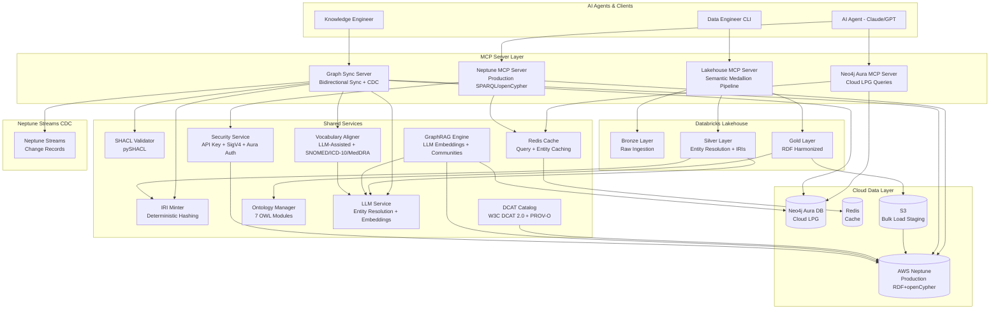
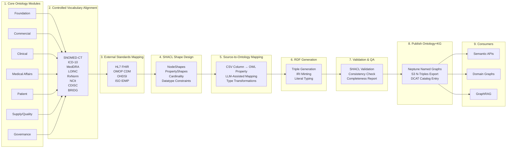
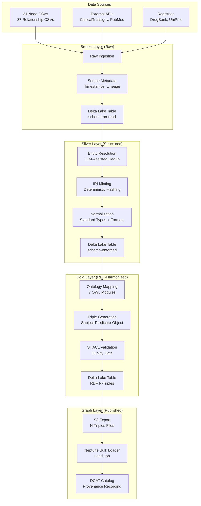
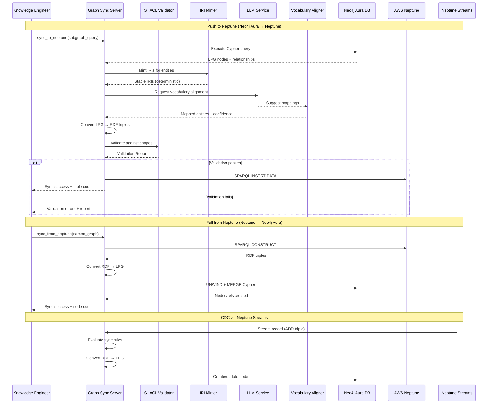
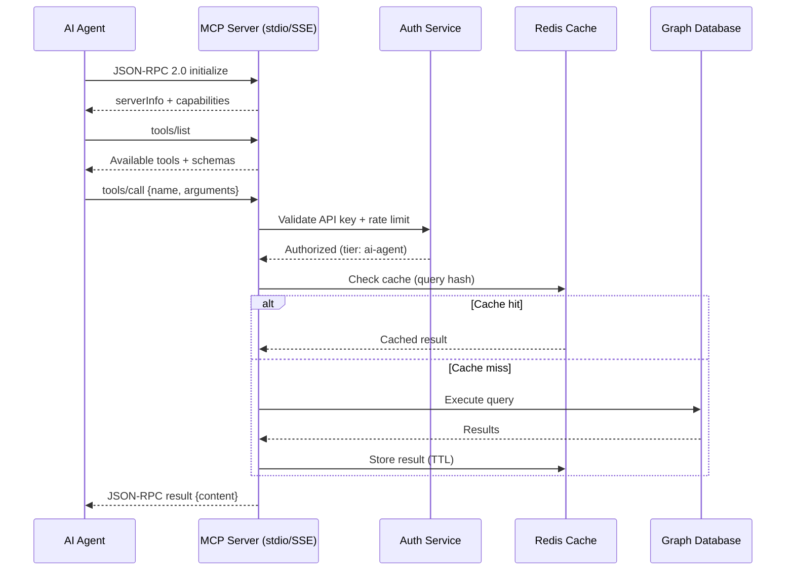

# Design Document: Neo4j-Neptune MCP Platform

## Overview

This design describes a multi-server MCP platform that bridges **Neo4j Aura DB** (cloud-hosted LPG for exploration and development queries) with **AWS Neptune** (production RDF + openCypher with SigV4 auth), integrated with a **Databricks Lakehouse** Semantic Medallion architecture for progressive data refinement. An **LLM API** provides intelligent entity resolution, vocabulary alignment, ontology mapping, and GraphRAG embeddings.

The platform manages a BioMedical Knowledge Graph containing **31 node types** and **37 relationship types** across oncology, genomics, clinical trials, pharmacology, patient outcomes, supply/quality, and governance domains.

Four MCP servers expose tools over JSON-RPC 2.0 (stdio + SSE transport):
- **Neo4j Aura MCP Server**: Cloud Cypher queries, path-finding, community detection against Neo4j Aura DB
- **Neptune MCP Server**: Production SPARQL/openCypher with SigV4, bulk load management
- **Graph Sync Server**: Bidirectional Neo4j Aura ↔ Neptune sync with SHACL validation, IRI minting, LLM-assisted vocabulary alignment, Neptune Streams CDC
- **Lakehouse MCP Server**: Databricks Semantic Medallion pipeline (Bronze → Silver → Gold → Graph)

Supporting services include SHACL validation (pySHACL), DCAT cataloging (rdflib), GraphRAG (LLM embeddings + community detection), Redis caching, LLM-assisted entity resolution, and ontology module management (7 OWL modules).

### Key Design Decisions

| Decision | Choice | Rationale |
|----------|--------|-----------|
| Protocol | MCP over JSON-RPC 2.0 | Standard AI agent interoperability; supports stdio and SSE transport |
| Cloud Graph (LPG) | Neo4j Aura DB | Managed cloud service; user provides Aura URI + credentials; GDS available |
| Production Graph | AWS Neptune | Managed service; SPARQL + openCypher dual interface; Neptune Streams for CDC |
| Auth (Neo4j) | Aura credentials (URI + user/password) | Standard Neo4j Aura authentication via bolt+s:// |
| Auth (Neptune) | AWS IAM SigV4 | Zero-trust access; role-based; standard AWS credential chain |
| Data Processing | Databricks Lakehouse | Delta Lake ACID transactions; medallion architecture; workspace URL + PAT auth |
| LLM Integration | External LLM API (API key) | Entity resolution, vocabulary alignment, ontology mapping, embedding generation |
| RDF Validation | pySHACL | Python-native SHACL validation; integrates with rdflib |
| RDF Library | rdflib 7.x | Python standard for RDF manipulation; Graph, Namespace, serialization |
| Caching | Redis 7.x (local or cloud) | Sub-millisecond lookups; TTL-based expiration; entity-aware invalidation |
| Embeddings | LLM API + node2vec | LLM for text embeddings, node2vec for structural embeddings |
| Language | Python 3.11+ | Async ecosystem; ML/NLP alignment; existing codebase compatibility |
| CDC | Neptune Streams | Native Neptune change capture; checkpoint-based resumption |
| Ontology | 7 OWL modules | Modular domain separation; Foundation + 6 domain modules |

## Architecture

### High-Level System Architecture



### Ontology Pipeline Data Flow

Following the semantic ontology pipeline architecture:



### Semantic Medallion Pipeline Flow



### Neo4j Aura ↔ Neptune Sync Flow



### MCP Tool Interaction Model



## Components and Interfaces

### 1. Neo4j Aura MCP Server

Provides LPG query tools against the cloud-hosted Neo4j Aura DB instance.

**Connection**: `bolt+s://<aura-instance>.databases.neo4j.io` with user/password auth.

| Tool Name | Description | Key Parameters |
|-----------|-------------|----------------|
| `neo4j_query` | Execute Cypher query | `query: str`, `parameters: dict`, `timeout: int=10` |
| `neo4j_pathfind` | Find shortest paths | `source_id: str`, `target_id: str`, `algorithm: enum[dijkstra,bfs]`, `max_depth: int=10` |
| `neo4j_community` | Run community detection | `algorithm: enum[louvain,label_prop,wcc]`, `node_labels: list[str]` |
| `neo4j_expand` | Expand neighborhood | `node_id: str`, `depth: int`, `rel_types: list[str]` |
| `neo4j_schema` | Get graph schema | (none) |

### 2. Neptune MCP Server

Provides dual-interface query tools (SPARQL + openCypher) against AWS Neptune.

**Connection**: `https://<cluster-endpoint>:<port>` with IAM SigV4 signing.

| Tool Name | Description | Key Parameters |
|-----------|-------------|----------------|
| `neptune_sparql` | Execute SPARQL 1.1 | `query: str`, `named_graph: str?`, `timeout: int=30` |
| `neptune_cypher` | Execute openCypher | `query: str`, `parameters: dict` |
| `neptune_bulk_load` | Initiate bulk load | `s3_uri: str`, `format: enum[ntriples,turtle,rdfxml]`, `named_graph: str` |
| `neptune_load_status` | Check load job | `job_id: str` |
| `neptune_status` | Cluster status | (none) |

### 3. Graph Sync MCP Server

Manages bidirectional sync between Neo4j Aura and Neptune with validation pipeline.

| Tool Name | Description | Key Parameters |
|-----------|-------------|----------------|
| `sync_to_neptune` | Push subgraph to Neptune | `cypher_query: str`, `named_graph: str`, `validate: bool=true` |
| `sync_from_neptune` | Pull from Neptune | `sparql_construct: str`, `target_labels: list[str]` |
| `sync_validate` | Validate without sync | `cypher_query: str` |
| `sync_status` | Get sync state | `job_id: str?` |
| `sync_conflicts` | List conflicts | `since: datetime?`, `resolved: bool?` |
| `sync_stream_status` | Neptune Streams checkpoint | (none) |

### 4. Lakehouse MCP Server

Manages the Databricks Semantic Medallion pipeline.

**Connection**: `https://<workspace-url>` with Personal Access Token (PAT) auth.

| Tool Name | Description | Key Parameters |
|-----------|-------------|----------------|
| `lakehouse_ingest_bronze` | Bronze ingestion | `source: str`, `source_type: enum[csv,api,registry]`, `metadata: dict` |
| `lakehouse_process_silver` | Silver processing | `bronze_table: str`, `entity_type: str` |
| `lakehouse_transform_gold` | Gold transformation | `silver_table: str`, `ontology_module: str` |
| `lakehouse_run_pipeline` | Full pipeline | `source: str`, `source_type: str`, `entity_type: str` |
| `lakehouse_export_rdf` | Export for Neptune | `gold_table: str`, `s3_target: str` |
| `lakehouse_status` | Pipeline status | `job_id: str?` |

### 5. Shared Service Interfaces

#### SHACL Validator

```python
class SHACLValidator:
    async def validate(self, data_graph: Graph, shapes_graph: Graph) -> ValidationReport
    async def validate_entity(self, entity_iri: URIRef, data_graph: Graph) -> ValidationReport
    def get_shapes_for_type(self, node_type: str) -> Graph
    def load_shapes(self, shapes_path: str) -> None
```

#### IRI Minter

```python
class IRIMinter:
    def mint(self, entity_type: str, identifying_props: dict) -> URIRef
    def mint_batch(self, entities: list[dict]) -> list[URIRef]
    def reverse_lookup(self, iri: URIRef) -> dict | None
```

#### Vocabulary Aligner (LLM-Assisted)

```python
class VocabularyAligner:
    async def align(self, entity: dict, entity_type: str) -> list[VocabMapping]
    async def align_batch(self, entities: list[dict], entity_type: str) -> list[list[VocabMapping]]
    async def suggest_mapping(self, entity_name: str, target_vocab: str) -> VocabMapping
```

#### GraphRAG Engine

```python
class GraphRAGEngine:
    async def generate_embeddings(self, node_ids: list[str], method: str = "hybrid") -> EmbeddingResult
    async def search_similar(self, query_vector: list[float], top_k: int = 10) -> list[SimilarNode]
    async def detect_communities(self, algorithm: str = "louvain") -> list[Community]
    async def extract_subgraph(self, seed_id: str, hops: int = 2, rel_types: list[str] = None) -> Subgraph
```

#### DCAT Catalog

```python
class DCATCatalog:
    async def register_dataset(self, metadata: DatasetMetadata) -> URIRef
    async def record_provenance(self, dataset_iri: URIRef, activity: ProvenanceActivity) -> None
    async def search(self, keyword: str = None, theme: str = None, temporal: DateRange = None) -> list[DatasetEntry]
    async def record_derivation(self, source_iri: URIRef, derived_iri: URIRef) -> None
```

#### LLM Service

```python
class LLMService:
    async def generate_embedding(self, text: str) -> list[float]
    async def generate_embeddings_batch(self, texts: list[str]) -> list[list[float]]
    async def resolve_entity(self, name: str, context: dict, candidates: list[dict]) -> EntityResolution
    async def suggest_vocab_mapping(self, entity: dict, target_vocab: str) -> VocabSuggestion
    async def map_columns_to_ontology(self, columns: list[str], ontology_module: str) -> list[ColumnMapping]
```

## Data Models

### Node Types (31 total)

Organized by ontology module:

#### Foundation Module (12 nodes)

| Node Type | ID Field | Key Properties | Ontology Source |
|-----------|----------|----------------|-----------------|
| Disease | `disease_id` | name, category, icd10_code, prevalence | ICD-10 |
| Drug | `drug_id` | name, generic_name, drug_type, approval_status, mechanism | DrugBank |
| Gene | `gene_id` | symbol, name, chromosome, function | HGNC |
| Protein | `protein_id` | name, uniprot_id, protein_class, cellular_location | UniProt |
| Pathway | `pathway_id` | name, kegg_id, category, organism | KEGG |
| BiologicalProcess | `process_id` | name, go_id, category | Gene Ontology |
| MolecularFunction | `function_id` | name, go_id, category | Gene Ontology |
| Anatomy | `anatomy_id` | name, uberon_id, system | UBERON |
| CellType | `cell_type_id` | name, cell_ontology_id, category, location | Cell Ontology |
| Phenotype | `phenotype_id` | name, hpo_id, category | HPO |
| Biomarker | `biomarker_id` | name, type, measurement_unit, clinical_significance | — |
| Exposure | `exposure_id` | name, exposure_type, category, risk_level | IARC/WHO |

#### Commercial Module (2 nodes)

| Node Type | ID Field | Key Properties | Ontology Source |
|-----------|----------|----------------|-----------------|
| RegulatorySubmission | `submission_id` | drug_id, agency, submission_type, status, market | FDA/EMA |
| ExternalMapping | `entity_id` | entity_type, standard, external_id, confidence | Multi-vocab |

#### Clinical Module (3 nodes)

| Node Type | ID Field | Key Properties | Ontology Source |
|-----------|----------|----------------|-----------------|
| ClinicalTrial | `trial_id` | nct_id, title, phase, status, enrollment | ClinicalTrials.gov |
| AdverseEvent | `event_id` | name, severity, category, frequency | MedDRA |
| ResearchPaper | `paper_id` | title, journal, publication_date, doi, citations | PubMed |

#### Medical Affairs Module (3 nodes)

| Node Type | ID Field | Key Properties | Ontology Source |
|-----------|----------|----------------|-----------------|
| AdvisoryBoard | `board_id` | name, therapeutic_area, meeting_frequency, member_count | — |
| MedicalInformationRequest | `request_id` | requester_type, therapeutic_area, drug_id, question_category | — |
| Researcher | `researcher_id` | name, title, specialization, h_index | — |

#### Patient Module (3 nodes)

| Node Type | ID Field | Key Properties | Ontology Source |
|-----------|----------|----------------|-----------------|
| Patient | `patient_id` | age_group, gender, ethnicity, diagnosis_year, consent_status | OMOP CDM |
| PatientOutcome | `outcome_id` | patient_id, treatment_id, response_type, progression_free_months | CDISC |
| PatientReportedOutcome | `pro_id` | patient_id, questionnaire_type, score, assessment_date | PRO-CTCAE |

#### Supply/Quality Module (3 nodes)

| Node Type | ID Field | Key Properties | Ontology Source |
|-----------|----------|----------------|-----------------|
| ManufacturingSite | `site_id` | name, country, city, gmp_certified, capacity | ISO IDMP |
| DrugBatch | `batch_id` | drug_id, manufacturing_site_id, production_date, quality_status | GS1/DSCSA |
| QualityEvent | `event_id` | batch_id, event_type, severity, capa_id | ICH Q10 |

#### Governance Module (2 nodes)

| Node Type | ID Field | Key Properties | Ontology Source |
|-----------|----------|----------------|-----------------|
| DataGovernancePolicy | `policy_id` | title, category, scope, effective_date, owner, status | DCAT/ODRL |
| ComplianceRecord | `record_id` | policy_id, entity_type, entity_id, compliance_status, auditor | — |

#### GraphRAG Module (3 nodes)

| Node Type | ID Field | Key Properties | Ontology Source |
|-----------|----------|----------------|-----------------|
| Entity | `entity_id` | name, entity_type, source | NCBI Taxonomy |
| Cluster | `cluster_id` | name, cluster_type, algorithm, node_count | GraphRAG |
| ClusterSummary | `summary_id` | cluster_id, summary_text, key_entities, confidence_score | GraphRAG |

#### Organizational (1 node)

| Node Type | ID Field | Key Properties | Ontology Source |
|-----------|----------|----------------|-----------------|
| Institution | `institution_id` | name, type, country, city, research_budget_millions | — |

### Relationship Types (37 total)

| Relationship | Source → Target | Key Properties |
|---|---|---|
| DRUG_TREATS_DISEASE | Drug → Disease | — |
| DRUG_TARGETS_PROTEIN | Drug → Protein | — |
| GENE_ASSOCIATED_WITH_DISEASE | Gene → Disease | — |
| GENE_HAS_MOLECULAR_FUNCTION | Gene → MolecularFunction | — |
| GENE_INVOLVED_IN_BIOLOGICAL_PROCESS | Gene → BiologicalProcess | — |
| GENE_PARTICIPATES_IN_PATHWAY | Gene → Pathway | — |
| PROTEIN_INVOLVED_IN_PATHWAY | Protein → Pathway | — |
| PROTEIN_INVOLVED_IN_BIOLOGICAL_PROCESS | Protein → BiologicalProcess | — |
| PROTEIN_HAS_MOLECULAR_FUNCTION | Protein → MolecularFunction | — |
| PROTEIN_EXPRESSED_IN_ANATOMY | Protein → Anatomy | — |
| DISEASE_AFFECTS_ANATOMY | Disease → Anatomy | — |
| DISEASE_HAS_PHENOTYPE | Disease → Phenotype | — |
| DISEASE_INVOLVES_CELL_TYPE | Disease → CellType | — |
| CELL_TYPE_FOUND_IN_ANATOMY | CellType → Anatomy | — |
| PATHWAY_INVOLVES_BIOLOGICAL_PROCESS | Pathway → BiologicalProcess | — |
| PHENOTYPE_ASSOCIATED_WITH_GENE | Phenotype → Gene | — |
| EXPOSURE_AFFECTS_GENE | Exposure → Gene | — |
| EXPOSURE_INCREASES_RISK_DISEASE | Exposure → Disease | — |
| BIOMARKER_PREDICTS_RESPONSE | Biomarker → Drug | — |
| ENTITY_ASSOCIATED_WITH_DISEASE | Entity → Disease | — |
| TRIAL_INVESTIGATES_DRUG | ClinicalTrial → Drug | — |
| TRIAL_STUDIES_DISEASE | ClinicalTrial → Disease | — |
| TRIAL_REPORTS_ADVERSE_EVENT | ClinicalTrial → AdverseEvent | — |
| INSTITUTION_SPONSORS_TRIAL | Institution → ClinicalTrial | — |
| PAPER_MENTIONS_DISEASE | ResearchPaper → Disease | — |
| PAPER_MENTIONS_DRUG | ResearchPaper → Drug | — |
| PAPER_AUTHORED_BY | ResearchPaper → Researcher | — |
| RESEARCHER_AFFILIATED_WITH | Researcher → Institution | — |
| RESEARCHER_ADVISES_BOARD | Researcher → AdvisoryBoard | — |
| PATIENT_ENROLLED_IN_TRIAL | Patient → ClinicalTrial | — |
| PATIENT_HAS_OUTCOME | Patient → PatientOutcome | — |
| DRUG_MANUFACTURED_AT | Drug → ManufacturingSite | — |
| BATCH_PRODUCED_FOR_DRUG | DrugBatch → Drug | — |
| NODE_BELONGS_TO_CLUSTER | * → Cluster | — |
| CLUSTER_HAS_SUMMARY | Cluster → ClusterSummary | — |
| POLICY_GOVERNS_ENTITY | DataGovernancePolicy → * | enforcement_level |
| SUBMISSION_FOR_DRUG | RegulatorySubmission → Drug | — |

### IRI Namespace Design

Base namespace: `https://biomedkg.org/ontology/`

| Module | Namespace Prefix | Example IRI |
|--------|-----------------|-------------|
| Foundation | `biomedkg:foundation/` | `https://biomedkg.org/ontology/Disease/sha256_abc123` |
| Commercial | `biomedkg:commercial/` | `https://biomedkg.org/ontology/RegulatorySubmission/sha256_def456` |
| Clinical | `biomedkg:clinical/` | `https://biomedkg.org/ontology/ClinicalTrial/sha256_ghi789` |
| Medical Affairs | `biomedkg:medaffairs/` | `https://biomedkg.org/ontology/AdvisoryBoard/sha256_jkl012` |
| Patient | `biomedkg:patient/` | `https://biomedkg.org/ontology/Patient/sha256_mno345` |
| Supply/Quality | `biomedkg:supply/` | `https://biomedkg.org/ontology/DrugBatch/sha256_pqr678` |
| Governance | `biomedkg:governance/` | `https://biomedkg.org/ontology/DataGovernancePolicy/sha256_stu901` |

IRI minting formula: `https://biomedkg.org/ontology/{OntologyClass}/{sha256(canonical(identifying_properties))[:16]}`

Where `canonical()` sorts property keys alphabetically and concatenates `key=value` pairs with `|` separator before SHA-256 hashing.

### Configuration Model

```python
class NeptuneSettings(BaseSettings):
    """AWS Neptune configuration."""
    model_config = SettingsConfigDict(env_prefix="NEPTUNE_")
    cluster_endpoint: str  # e.g. "my-cluster.cluster-xxxxx.us-east-1.neptune.amazonaws.com"
    port: int = 8182
    region: str = "us-east-1"
    iam_role_arn: str = ""  # For bulk loader
    use_iam_auth: bool = True

class Neo4jAuraSettings(BaseSettings):
    """Neo4j Aura DB configuration."""
    model_config = SettingsConfigDict(env_prefix="NEO4J_")
    uri: str  # e.g. "neo4j+s://xxxxxxxx.databases.neo4j.io"
    user: str = "neo4j"
    password: str  # Aura-generated password
    database: str = "neo4j"
    max_connection_pool_size: int = 50
    connection_timeout: int = 30

class DatabricksSettings(BaseSettings):
    """Databricks workspace configuration."""
    model_config = SettingsConfigDict(env_prefix="DATABRICKS_")
    workspace_url: str  # e.g. "https://adb-xxxxx.azuredatabricks.net"
    access_token: str  # Personal Access Token
    cluster_id: str = ""
    warehouse_id: str = ""
    catalog: str = "biomedkg"
    schema: str = "semantic_medallion"

class LLMSettings(BaseSettings):
    """LLM API configuration."""
    model_config = SettingsConfigDict(env_prefix="LLM_")
    api_key: str
    base_url: str = "https://api.openai.com/v1"
    model: str = "text-embedding-3-small"
    chat_model: str = "gpt-4o-mini"
    max_tokens: int = 4096
    temperature: float = 0.1
    embedding_dimensions: int = 1536

class RedisSettings(BaseSettings):
    """Redis cache configuration."""
    model_config = SettingsConfigDict(env_prefix="REDIS_")
    url: str = "redis://localhost:6379"
    password: str = ""
    db: int = 0
    query_ttl: int = 300
    entity_ttl: int = 3600
```

### Security Architecture

```
┌─────────────────────────────────────────────────────────────────┐
│                      Security Layer                               │
├─────────────────────────────────────────────────────────────────┤
│                                                                   │
│  ┌─────────────┐  ┌──────────────┐  ┌─────────────────────────┐│
│  │ API Key Auth │  │ Rate Limiter │  │ Audit Logger            ││
│  │ X-API-Key    │  │ Per-tier     │  │ Timestamp + Caller +    ││
│  │ header       │  │ limits       │  │ Tool + Duration + Status ││
│  └──────┬──────┘  └──────┬───────┘  └─────────────────────────┘│
│         │                 │                                       │
│  ┌──────┴─────────────────┴──────────────────────────────────┐  │
│  │              Credential Management                         │  │
│  ├────────────────────────────────────────────────────────────┤  │
│  │ Neo4j Aura: bolt+s URI + user/password (env vars)         │  │
│  │ Neptune:    IAM SigV4 (AWS credential chain)              │  │
│  │ Databricks: Workspace URL + PAT (env var)                 │  │
│  │ LLM API:   API key (env var)                              │  │
│  │ Redis:     Connection URL + optional password (env var)    │  │
│  └────────────────────────────────────────────────────────────┘  │
│                                                                   │
│  Rate Limit Tiers:                                               │
│  • admin:     500 req/min                                        │
│  • ai-agent:  200 req/min                                        │
│  • read-only: 100 req/min                                        │
│  • write:      20 req/min                                        │
└─────────────────────────────────────────────────────────────────┘
```

### Redis Caching Strategy

| Cache Scope | Key Pattern | TTL | Invalidation Trigger |
|---|---|---|---|
| Cypher query result | `neo4j:query:{sha256(query+params)}` | 300s | Sync operation touching affected nodes |
| SPARQL query result | `neptune:sparql:{sha256(query)}` | 300s | Neptune Streams change to relevant graph |
| Entity lookup | `entity:{type}:{id}` | 3600s | Sync or mutation of entity |
| Embedding vector | `embedding:{node_id}` | 86400s | Node property change |
| Vocabulary mapping | `vocab:{entity_type}:{name_hash}` | 86400s | Manual invalidation |
| Community assignment | `community:{algorithm}:{hash}` | 3600s | Graph structure change |

Invalidation uses entity-aware tracking: each cache entry stores a set of entity IDs it references. When a sync operation modifies entities, all cache entries referencing those entities are invalidated.

### Neptune Streams CDC Design

```python
class NeptuneStreamReader:
    """Reads Neptune Streams for change data capture."""
    
    checkpoint_store: str  # Redis key or DynamoDB table for checkpoint
    poll_interval: int = 5  # seconds
    batch_size: int = 100
    
    async def poll(self) -> list[StreamRecord]:
        """Poll for new stream records since last checkpoint."""
        
    async def process_record(self, record: StreamRecord) -> None:
        """Process a single CDC record and apply sync rules."""
        
    async def save_checkpoint(self, commit_num: int) -> None:
        """Persist the latest processed commit number."""
        
    async def handle_retention_gap(self) -> None:
        """Handle case where checkpoint is behind retention window."""
```

Stream records are processed with these sync rules:
1. **ADD triple** → Check if subject IRI maps to a known entity type → Convert to LPG → MERGE into Neo4j Aura
2. **REMOVE triple** → Find corresponding LPG node/relationship → DELETE or remove property
3. **Conflict detection** → Compare timestamps → Apply last-writer-wins → Record in audit trail

### SHACL Validation Pipeline

SHACL shapes are defined per node type, enforcing:
- Required properties (sh:minCount 1)
- Property datatypes (sh:datatype xsd:string, xsd:integer, xsd:date, etc.)
- Controlled value sets (sh:in for enum-like fields)
- Cardinality constraints (sh:maxCount for single-valued properties)
- Class constraints (sh:class for object properties)

Example shape for Drug:
```turtle
biomedkg:DrugShape a sh:NodeShape ;
    sh:targetClass biomedkg:Drug ;
    sh:property [
        sh:path biomedkg:drugId ;
        sh:minCount 1 ;
        sh:maxCount 1 ;
        sh:datatype xsd:string ;
    ] ;
    sh:property [
        sh:path biomedkg:name ;
        sh:minCount 1 ;
        sh:datatype xsd:string ;
    ] ;
    sh:property [
        sh:path biomedkg:drugType ;
        sh:minCount 1 ;
        sh:in ("Small Molecule" "Monoclonal Antibody" "Biologic" "ADC" "Gene Therapy") ;
    ] ;
    sh:property [
        sh:path biomedkg:approvalStatus ;
        sh:in ("Approved" "Investigational" "Withdrawn" "Phase III") ;
    ] .
```

### GraphRAG Pipeline

The GraphRAG engine combines LLM-generated text embeddings with graph-structural embeddings:

1. **Text Embeddings** (LLM API): Each node's textual properties (name, description, etc.) are embedded via the LLM embedding model
2. **Structural Embeddings** (node2vec): Graph topology is captured through random walks
3. **Hybrid Vectors**: Text and structural embeddings are concatenated or combined via learned projection
4. **Community Detection**: Louvain algorithm identifies communities; LLM generates natural-language summaries of each community
5. **Subgraph Extraction**: Seed entity + hop distance + relationship type filter produces context windows for RAG

### DCAT Catalog with PROV-O

Each dataset published to any layer gets a DCAT entry:

```turtle
<https://biomedkg.org/catalog/bronze/clinical_trials_2024>
    a dcat:Dataset ;
    dct:title "Clinical Trials Bronze Ingest 2024-01" ;
    dct:description "Raw ClinicalTrials.gov data ingested from API" ;
    dcat:distribution [
        a dcat:Distribution ;
        dcat:mediaType "application/x-delta-lake" ;
        dcat:accessURL "dbfs:/biomedkg/bronze/clinical_trials" ;
    ] ;
    dct:temporal [ dcat:startDate "2024-01-01"^^xsd:date ] ;
    prov:wasGeneratedBy [
        a prov:Activity ;
        prov:startedAtTime "2024-01-15T10:00:00Z"^^xsd:dateTime ;
        prov:wasAssociatedWith <https://biomedkg.org/agent/lakehouse_pipeline> ;
    ] .
```

Derivation chains track Bronze → Silver → Gold → Neptune transformations.


## Correctness Properties

*A property is a characteristic or behavior that should hold true across all valid executions of a system — essentially, a formal statement about what the system should do. Properties serve as the bridge between human-readable specifications and machine-verifiable correctness guarantees.*

### Property 1: IRI Minting Idempotence

*For any* entity with a set of identifying properties, minting an IRI from those properties multiple times SHALL always produce the identical IRI, and the IRI SHALL conform to the pattern `https://biomedkg.org/ontology/{OntologyClass}/{hash}`.

**Validates: Requirements 3.4, 8.1, 8.2**

### Property 2: SHACL Validator Detects Constraint Violations

*For any* RDF data graph with known constraint violations (cardinality, datatype, or class constraints) against a SHACL shapes graph, the validator SHALL identify all violations with correct severity levels, and *for any* data graph with zero violations, the validator SHALL report conformance as true.

**Validates: Requirements 5.1, 5.2, 5.3, 5.4, 5.5**

### Property 3: Sync Batch Atomicity

*For any* sync batch containing at least one entity that fails SHACL validation, the Graph Sync Server SHALL reject the entire batch (no partial writes to Neptune) and return a complete validation report.

**Validates: Requirements 3.8**

### Property 4: Conflict Resolution is Deterministic (Last-Writer-Wins)

*For any* two conflicting entity versions with distinct timestamps, the conflict resolution SHALL always select the version with the later timestamp, regardless of which database (Neo4j Aura or Neptune) the later version originates from.

**Validates: Requirements 3.6**

### Property 5: Vocabulary Alignment Targets Correct Vocabulary Per Entity Type

*For any* biomedical entity of type T, the Vocabulary Aligner SHALL target the correct controlled vocabulary set for T (Drug→RxNorm, Disease→ICD-10/SNOMED-CT, AdverseEvent→MedDRA, Gene/Protein→NCIt/UniProt), and all returned confidence scores SHALL be in the range [0.0, 1.0], and entities with confidence below 0.7 SHALL be flagged for manual review.

**Validates: Requirements 8.3, 8.4, 8.5, 8.6, 8.7**

### Property 6: Cache Correctness (Store and Retrieve)

*For any* graph query executed twice with identical parameters within the TTL window, the second execution SHALL return the cached result without executing the query against the graph database, and the cached entry SHALL use the correct TTL (300s for queries, 3600s for entity lookups).

**Validates: Requirements 9.1, 9.2**

### Property 7: Cache Invalidation on Sync

*For any* set of entities modified by a sync operation, ALL cache entries referencing any of those entities SHALL be invalidated, and cache entries not referencing the modified entities SHALL remain unaffected.

**Validates: Requirements 9.3**

### Property 8: Neptune Streams CDC Conversion Correctness

*For any* Neptune Streams change record representing a new entity or relationship (ADD triple), the RDF-to-LPG conversion SHALL produce a valid Neo4j node or relationship with all mapped properties preserved, and the stream checkpoint SHALL monotonically increase after processing.

**Validates: Requirements 11.1, 11.2, 11.3, 11.4**

### Property 9: Embedding Similarity Ordering

*For any* embedding index and query vector with top-k parameter, the returned results SHALL be ordered by descending similarity score, the result count SHALL be at most k, and all returned vectors SHALL have consistent dimensionality.

**Validates: Requirements 7.2**

### Property 10: Community Detection Complete Assignment

*For any* connected graph submitted for community detection, every node SHALL be assigned to exactly one community, and each community SHALL have a non-empty summary description.

**Validates: Requirements 7.3**

### Property 11: Rate Limiting Enforcement

*For any* API key with tier T (admin=500, ai-agent=200, read-only=100, write=20 requests/minute), submitting N requests within one minute SHALL succeed for N ≤ tier_limit and SHALL be throttled for N > tier_limit.

**Validates: Requirements 10.4**

### Property 12: Authentication Rejection

*For any* MCP tool invocation without a valid API key in the X-API-Key header, the platform SHALL return a JSON-RPC 2.0 error with code -32600 and the tool SHALL NOT be executed.

**Validates: Requirements 10.1, 10.3**

### Property 13: Audit Log Completeness

*For any* tool invocation (successful or failed), the audit log SHALL contain an entry with timestamp, tool name, caller identity, execution duration, and success/failure status.

**Validates: Requirements 10.5**

### Property 14: DCAT Provenance Chain

*For any* dataset transformation in the medallion pipeline (Bronze→Silver, Silver→Gold, Gold→Neptune), the DCAT Catalog SHALL record a `prov:wasDerivedFrom` triple linking the output dataset to its input dataset, and the provenance activity SHALL include the generation timestamp and responsible agent.

**Validates: Requirements 6.2, 6.5**

### Property 15: Subgraph Extraction Depth Bound

*For any* seed entity and hop distance parameter h, all nodes in the extracted subgraph SHALL be reachable from the seed within at most h hops, and all relationships in the subgraph SHALL match the specified relationship type filter.

**Validates: Requirements 7.4**

### Property 16: Retry with Exponential Backoff

*For any* Neptune request that receives HTTP 429 throttling errors, the system SHALL retry with exponential backoff delays, and SHALL NOT exceed 3 retry attempts before returning a throttling error to the caller.

**Validates: Requirements 2.6**

### Property 17: N-Triples Export Round Trip

*For any* Gold layer RDF dataset, exporting to N-Triples format and parsing the result back SHALL produce an RDF graph that is isomorphic to the original (all triples preserved).

**Validates: Requirements 4.7**

### Property 18: SPARQL Injection Prevention

*For any* user-provided parameter value (including values containing SPARQL keywords, quotes, angle brackets, or semicolons), the parameterized query SHALL not alter the query structure beyond substituting the parameter value safely.

**Validates: Requirements 2.8**

## Error Handling

### Error Categories and Responses

| Error Category | JSON-RPC Code | HTTP Status | Retry Strategy | Example |
|---|---|---|---|---|
| Authentication failure | -32600 | 401 | No retry | Invalid/missing API key |
| Rate limit exceeded | -32600 | 429 | Retry after window | Too many requests for tier |
| Connection unavailable | -32603 | 503 | Retry with backoff | Neo4j Aura / Neptune unreachable |
| Query timeout | -32603 | 408 | Reduce query complexity | Cypher > 10s |
| Validation failure | -32602 | 422 | Fix data, resubmit | SHACL shape violation |
| Neptune throttling | -32603 | 429 | Exponential backoff (max 3) | Neptune HTTP 429 |
| Bulk load failure | -32603 | 500 | Check data format | Invalid N-Triples |
| LLM API failure | -32603 | 502 | Retry with backoff (max 3) | LLM API timeout/error |
| Redis unavailable | — | — | Bypass cache | Redis connection failed |
| Stream retention gap | -32603 | — | Full resync | Checkpoint behind retention |

### Circuit Breaker Pattern

Each external service connection (Neo4j Aura, Neptune, Databricks, LLM API, Redis) is protected by a circuit breaker:
- **Closed** (normal): Requests pass through; failures counted
- **Open** (tripped): After 5 consecutive failures, requests fail fast for 30 seconds
- **Half-Open** (recovery): After recovery timeout, allow 3 test requests to determine if service is restored

### Graceful Degradation

| Service Down | Behavior |
|---|---|
| Redis | Bypass cache; queries execute directly against graph DB |
| LLM API | Fall back to rule-based vocabulary alignment (exact string match against lookup tables) |
| Neptune Streams | Queue sync operations; resume when streams are available |
| Databricks | Queue pipeline requests; return pending status |
| Neo4j Aura | Return connection error; Neptune tools remain available |
| Neptune | Return connection error; Neo4j Aura tools remain available |

## Testing Strategy

### Testing Approach

The platform uses a **dual testing strategy**:

1. **Property-Based Tests (Hypothesis)**: Verify universal properties that must hold across all valid inputs. Each property test runs **minimum 100 iterations** with random input generation.
2. **Unit Tests (pytest)**: Verify specific examples, edge cases, error conditions, and integration points.
3. **Integration Tests**: Verify connectivity and behavior with mocked external services.

### Property-Based Testing Configuration

- **Library**: [Hypothesis](https://hypothesis.readthedocs.io/) (already in dev dependencies)
- **Minimum iterations**: 100 per property
- **Tag format**: `Feature: neo4j-neptune-mcp-platform, Property {number}: {title}`
- **Marker**: `@pytest.mark.property`

### Test Organization

```
src/biomedical_kg_mcp/tests/
├── property/                          # Property-based tests
│   ├── test_iri_minting_props.py      # Property 1: IRI idempotence
│   ├── test_shacl_validation_props.py # Property 2: SHACL detection
│   ├── test_sync_atomicity_props.py   # Property 3: Batch atomicity
│   ├── test_conflict_resolution_props.py # Property 4: Last-writer-wins
│   ├── test_vocab_alignment_props.py  # Property 5: Vocabulary targeting
│   ├── test_cache_props.py            # Properties 6, 7: Cache correctness
│   ├── test_cdc_conversion_props.py   # Property 8: RDF→LPG conversion
│   ├── test_graphrag_props.py         # Properties 9, 10, 15: Embeddings + communities
│   ├── test_security_props.py         # Properties 11, 12, 13: Rate limiting + auth
│   ├── test_provenance_props.py       # Property 14: DCAT chains
│   ├── test_retry_props.py            # Property 16: Exponential backoff
│   ├── test_export_props.py           # Property 17: N-Triples round trip
│   └── test_injection_props.py        # Property 18: SPARQL injection prevention
├── unit/                              # Unit tests
│   ├── test_neo4j_aura_server.py
│   ├── test_neptune_server.py
│   ├── test_sync_server.py
│   ├── test_lakehouse_server.py
│   ├── test_shacl_validator.py
│   ├── test_iri_minter.py
│   ├── test_vocab_aligner.py
│   ├── test_dcat_catalog.py
│   ├── test_graphrag_engine.py
│   ├── test_llm_service.py
│   ├── test_cache_service.py
│   └── test_auth_service.py
├── integration/                       # Integration tests (mocked external services)
│   ├── test_neo4j_aura_integration.py
│   ├── test_neptune_integration.py
│   ├── test_databricks_integration.py
│   ├── test_pipeline_integration.py
│   └── test_sync_flow_integration.py
└── conftest.py                        # Shared fixtures and generators
```

### Custom Hypothesis Strategies

Key generators needed for property tests:

```python
# Entity generators for property-based tests
@st.composite
def entity_properties(draw, entity_type: str) -> dict:
    """Generate random valid entity properties for a given type."""
    ...

@st.composite  
def rdf_graph(draw, num_triples: int = None) -> Graph:
    """Generate random valid RDF graphs conforming to ontology."""
    ...

@st.composite
def shacl_shapes(draw) -> Graph:
    """Generate random SHACL shapes with constraints."""
    ...

@st.composite
def cypher_query(draw) -> str:
    """Generate random valid Cypher queries."""
    ...

@st.composite
def sparql_parameter_value(draw) -> str:
    """Generate parameter values including injection attempts."""
    ...
```

### Test Execution

```bash
# Run all property tests
pytest src/biomedical_kg_mcp/tests/property/ -m property --hypothesis-seed=0

# Run all unit tests
pytest src/biomedical_kg_mcp/tests/unit/

# Run integration tests (requires mocked services)
pytest src/biomedical_kg_mcp/tests/integration/ -m integration

# Run everything with coverage
pytest --cov=biomedical_kg_mcp --cov-report=html
```
