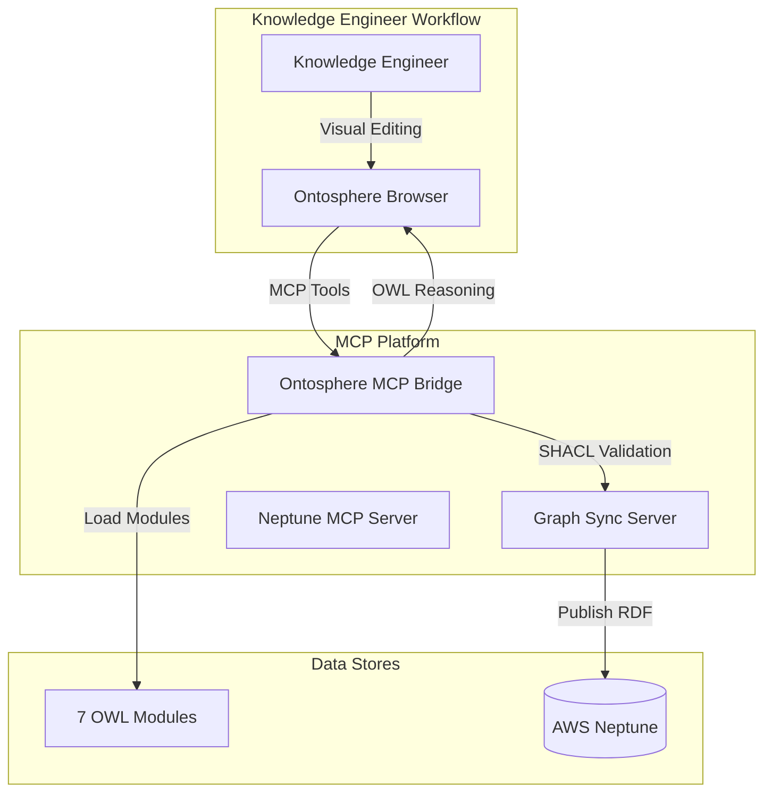

# Ontosphere Integration Guide

## Overview

Ontosphere is a browser-based RDF knowledge graph editor integrated with the Neo4j-Neptune MCP platform. It provides a visual interface for authoring, validating, and reasoning over the 7 biomedical ontology modules.

## Architecture



## Key Features

### 1. **7 OWL Ontology Modules**
- **Foundation**: BFO 2020 + RO upper ontology
- **Commercial**: Drug development, manufacturing, regulatory
- **Clinical**: Clinical trials, patients, adverse events
- **Medical Affairs**: Publications, researchers, advisory boards
- **Patient**: Patient outcomes, biomarkers, PROs
- **Supply/Quality**: Supply chain, batches, quality events
- **Governance**: Data policies, compliance, audit trails

### 2. **OWL 2 DL Reasoning**
- Runs Konclude reasoner in browser (WebAssembly)
- Infers subclass relationships, domain/range entailments
- Visual differentiation: amber dashed edges for inferred triples

### 3. **SHACL Validation Bridge**
- Ontosphere OWL reasoning → SHACL validation → Neptune sync
- Validates cardinality, datatype, class constraints
- Rejects non-conformant data before Neptune publish

### 4. **Persona-Based Startup URLs**
Pre-configured URLs for different user roles:

| Persona | Modules | Use Case |
|---------|---------|----------|
| Knowledge Engineer | All 7 modules | Full ontology suite |
| Clinical Researcher | Foundation, Clinical, Patient | Clinical trials and outcomes |
| Commercial Analyst | Foundation, Commercial, Supply/Quality | Drug development and supply chain |
| Medical Affairs | Foundation, Medical Affairs | Publications and advisory boards |
| Data Governance | Foundation, Governance | Data policies and compliance |

## MCP Tools

### `ontosphere_load_module`
Load a single ontology module into Ontosphere.

```json
{
  "name": "ontosphere_load_module",
  "arguments": {
    "module": "clinical"
  }
}
```

**Modules**: `foundation`, `commercial`, `clinical`, `medical_affairs`, `patient`, `supply_quality`, `governance`

### `ontosphere_load_all_modules`
Load all 7 modules at once.

```json
{
  "name": "ontosphere_load_all_modules",
  "arguments": {}
}
```

### `ontosphere_validate`
Run OWL 2 DL reasoning and validation.

```json
{
  "name": "ontosphere_validate",
  "arguments": {}
}
```

Returns inferred triple count and validation status.

### `ontosphere_export_rdf`
Export validated RDF in Turtle, RDF/XML, or JSON-LD.

```json
{
  "name": "ontosphere_export_rdf",
  "arguments": {
    "format": "turtle"
  }
}
```

### `ontosphere_sync_to_neptune`
Full pipeline: validate → export → sync to Neptune.

```json
{
  "name": "ontosphere_sync_to_neptune",
  "arguments": {}
}
```

### `ontosphere_generate_url`
Generate pre-configured startup URL.

```json
{
  "name": "ontosphere_generate_url",
  "arguments": {
    "modules": ["foundation", "clinical"],
    "rdf_url": "https://example.org/data.ttl"
  }
}
```

### `ontosphere_query_sparql`
Query loaded RDF via SPARQL.

```json
{
  "name": "ontosphere_query_sparql",
  "arguments": {
    "query": "SELECT ?s ?p ?o WHERE { ?s ?p ?o } LIMIT 10"
  }
}
```

## Usage Examples

### Example 1: Load and Validate Clinical Module

```python
from biomedical_kg_mcp.mcp_servers.ontosphere_bridge import OntosphereBridge

bridge = OntosphereBridge()

# Load clinical module
await bridge._load_module("clinical")

# Run OWL reasoning
validation = await bridge._validate()
print(f"Inferred triples: {validation[0].text}")

# Export validated RDF
rdf_data = await bridge._export_rdf("turtle")
```

### Example 2: Full Validation Pipeline

```python
from biomedical_kg_mcp.services.ontosphere_validation_bridge import OntosphereValidationBridge
from biomedical_kg_mcp.services.ontosphere_client import OntosphereClient
from biomedical_kg_mcp.services.shacl_validator import SHACLValidator
from biomedical_kg_mcp.mcp_servers.graph_sync_server import GraphSyncOrchestrator

client = OntosphereClient()
validator = SHACLValidator()
sync = GraphSyncOrchestrator()

bridge = OntosphereValidationBridge(client, validator, sync)

# Run full pipeline: OWL → SHACL → Neptune
result = await bridge.validate_and_sync(run_owl_reasoning=True)

print(f"Status: {result['status']}")
print(f"OWL inferred: {result['owl_reasoning']['inferred_triples']}")
print(f"SHACL conforms: {result['shacl_validation']['conforms']}")
print(f"Neptune synced: {result['neptune_sync']['triples_synced']}")
```

### Example 3: Generate Persona URLs

```python
from biomedical_kg_mcp.services.ontosphere_config_generator import OntosphereConfigGenerator

generator = OntosphereConfigGenerator()

# Generate URL for clinical researcher
url = generator.generate_url(persona="clinical_researcher")
print(url)
# https://thhanke.github.io/ontosphere/?ontologies=bfo2020,foaf&ontology=https://biomedkg.org/ontology/foundation.ttl,https://biomedkg.org/ontology/clinical.ttl,https://biomedkg.org/ontology/patient.ttl

# Generate all persona URLs
all_urls = generator.get_all_persona_urls()
for persona, url in all_urls.items():
    print(f"{persona}: {url}")
```

### Example 4: Load from Neptune SPARQL Endpoint

```python
generator = OntosphereConfigGenerator()

neptune_url = generator.generate_neptune_sparql_url(
    neptune_endpoint="https://my-neptune-cluster.cluster-xyz.us-west-2.neptune.amazonaws.com:8182",
    modules=["foundation", "clinical"]
)

print(neptune_url)
# Opens Ontosphere with live Neptune data
```

## Workflow: Knowledge Engineer

1. **Open Ontosphere** with pre-configured URL
   ```bash
   # Knowledge engineer persona - all modules
   open "$(python -c 'from biomedical_kg_mcp.services.ontosphere_config_generator import OntosphereConfigGenerator; print(OntosphereConfigGenerator().generate_url(persona="knowledge_engineer"))')"
   ```

2. **Author ontology** in visual canvas
   - Add classes, properties, restrictions
   - Draw relationships between concepts
   - Annotate with labels, comments, SKOS mappings

3. **Run OWL reasoning** (Konclude)
   - Click "Run Reasoning" button
   - View inferred triples (amber dashed edges)
   - Verify entailments are correct

4. **Export validated RDF**
   - Export as Turtle/RDF-XML/JSON-LD
   - Send to MCP platform for SHACL validation

5. **Sync to Neptune**
   - Use `ontosphere_sync_to_neptune` tool
   - Platform validates with SHACL shapes
   - Publishes to production Neptune graph

## Workflow: AI Agent

AI agents can interact with Ontosphere via MCP tools:

```json
// Step 1: Load foundation module
{
  "jsonrpc": "2.0",
  "method": "tools/call",
  "params": {
    "name": "ontosphere_load_module",
    "arguments": {"module": "foundation"}
  },
  "id": 1
}

// Step 2: Load clinical module
{
  "jsonrpc": "2.0",
  "method": "tools/call",
  "params": {
    "name": "ontosphere_load_module",
    "arguments": {"module": "clinical"}
  },
  "id": 2
}

// Step 3: Run reasoning
{
  "jsonrpc": "2.0",
  "method": "tools/call",
  "params": {
    "name": "ontosphere_validate",
    "arguments": {}
  },
  "id": 3
}

// Step 4: Sync to Neptune
{
  "jsonrpc": "2.0",
  "method": "tools/call",
  "params": {
    "name": "ontosphere_sync_to_neptune",
    "arguments": {}
  },
  "id": 4
}
```

## Integration with Graph Sync Server

The Ontosphere bridge connects to the existing Graph Sync Server:

1. **OWL Reasoning** in Ontosphere (client-side, Konclude WASM)
2. **Export RDF** from Ontosphere as Turtle
3. **Parse with rdflib** in Python
4. **SHACL Validation** via platform's `SHACLValidator`
5. **IRI Minting** via platform's `IRIMinter`
6. **Vocabulary Alignment** via platform's `VocabularyAligner` (LLM-assisted)
7. **Neptune Publish** via platform's `NeptuneMCPServer`

## Configuration

Add to `pyproject.toml`:

```toml
[tool.biomedical_kg_mcp.ontosphere]
base_url = "https://thhanke.github.io/ontosphere/"
default_persona = "knowledge_engineer"
enable_headless = true  # Use Playwright for automation
```

Add to `.env`:

```bash
# Ontosphere configuration
ONTOSPHERE_URL=https://thhanke.github.io/ontosphere/
ONTOSPHERE_HEADLESS=true
```

## Dependencies

Add to `requirements.txt` or `pyproject.toml`:

```
playwright>=1.40.0  # For headless browser automation
rdflib>=7.0.0       # Already present
```

Install Playwright browsers:

```bash
playwright install chromium
```

## Security Considerations

1. **Headless Browser**: Ontosphere client uses Playwright headless browser
   - Runs in isolated context
   - No access to host filesystem beyond explicit imports
   
2. **MCP Tool Authorization**: All Ontosphere tools respect platform's auth service
   - API key required
   - Rate limiting enforced
   - Audit logging enabled

3. **SHACL Validation**: All RDF exported from Ontosphere is validated before Neptune sync
   - Non-conformant data rejected
   - Validation reports logged

## Troubleshooting

### Issue: Playwright not installed
```
ImportError: playwright required for headless Ontosphere
```

**Solution**:
```bash
pip install playwright
playwright install chromium
```

### Issue: Ontosphere tools not found
```
ValueError: Unknown tool: ontosphere_load_module
```

**Solution**: Check platform routing in `platform.py`:
```python
elif method.startswith("ontosphere_"):
    return self.ontosphere_bridge
```

### Issue: SHACL validation fails
```
status: "shacl_validation_failed"
```

**Solution**: Review validation report:
```python
result = await bridge.validate_and_sync()
print(result['shacl_validation']['violation_details'])
```

Fix ontology issues in Ontosphere, re-run reasoning, and retry.

## References

- [Ontosphere GitHub](https://github.com/ThHanke/ontosphere)
- [Ontosphere Live Demo](https://thhanke.github.io/ontosphere/)
- [Model Context Protocol](https://modelcontextprotocol.io)
- [OWL 2 DL Profile](https://www.w3.org/TR/owl2-profiles/#OWL_2_DL)
- [SHACL Specification](https://www.w3.org/TR/shacl/)
- [BFO 2020](http://purl.obolibrary.org/obo/bfo.owl)

## Next Steps

1. **Create SHACL shapes** for all 31 node types in `src/biomedical_kg_mcp/shapes/`
2. **Generate 7 OWL modules** using `OntologyModuleLoader`
3. **Deploy modules** to `https://biomedkg.org/ontology/`
4. **Test full pipeline**: Ontosphere → SHACL → Neptune
5. **Document controlled vocabulary mappings** (SNOMED-CT, ICD-10, MedDRA, etc.)
